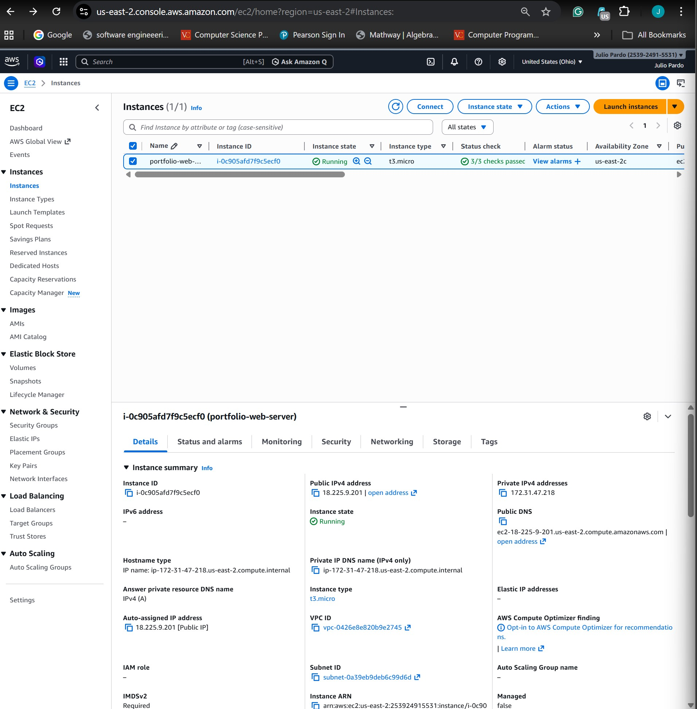
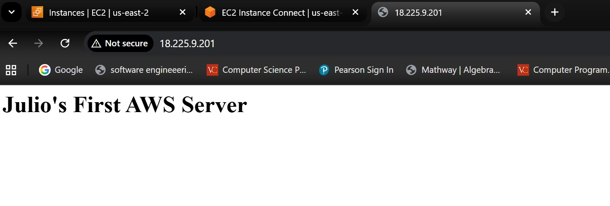

# aws-ec2-web-server
AWS project deploying a highly available EC2 web server using VPC, Security Groups, IAM roles, and CloudWatch monitoring.

## Deployment Screenshot

EC2 instance running with automated web server deployment.

Example of the deployed web page served from the EC2 instance.

