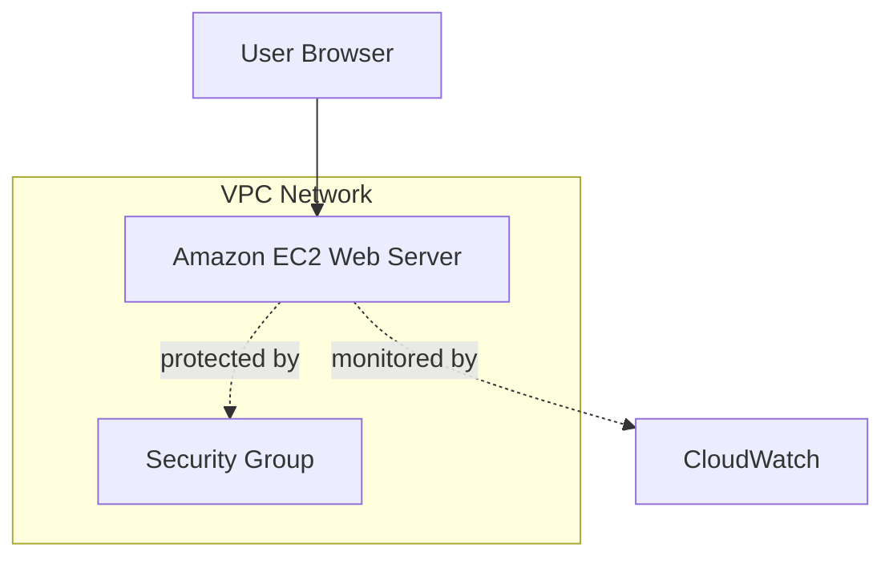

# AWS EC2 Web Server Architecture

## Architecture Overview

This project deploys an Apache web server on an Amazon EC2 instance inside a VPC.  
A security group controls inbound HTTP traffic, and Amazon CloudWatch collects monitoring metrics for the instance.
