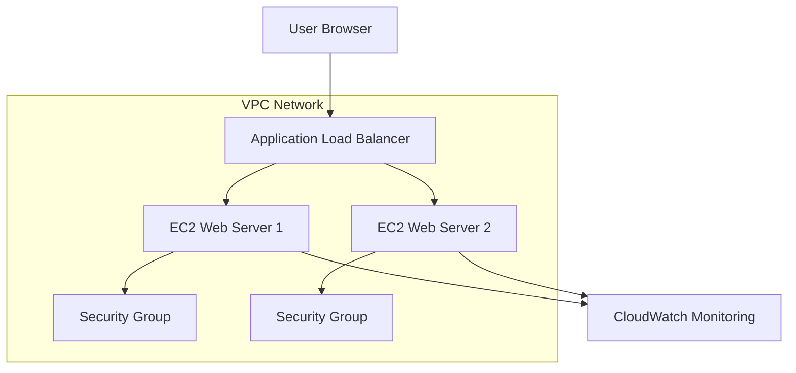

# AWS EC2 Web Server Architecture

```mermaid
graph TD

User[User Browser] --> ALB[Application Load Balancer]

subgraph VPC Network
    ALB --> EC1[EC2 Web Server 1]
    ALB --> EC2[EC2 Web Server 2]

    EC1 --> SG1[Security Group]
    EC2 --> SG2[Security Group]
end

EC1 --> CW[CloudWatch Monitoring]
EC2 --> CW
```
